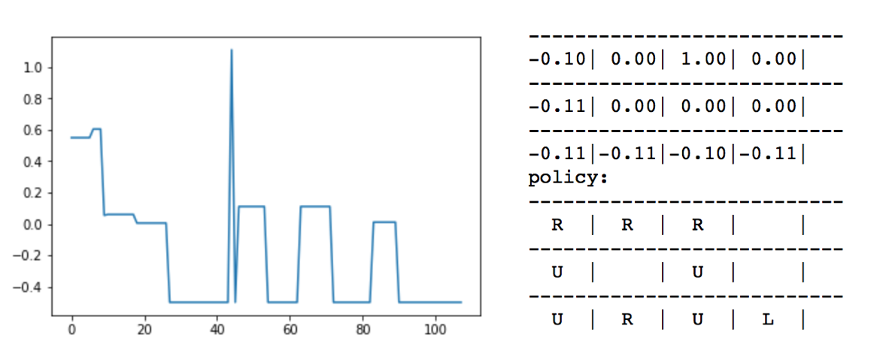
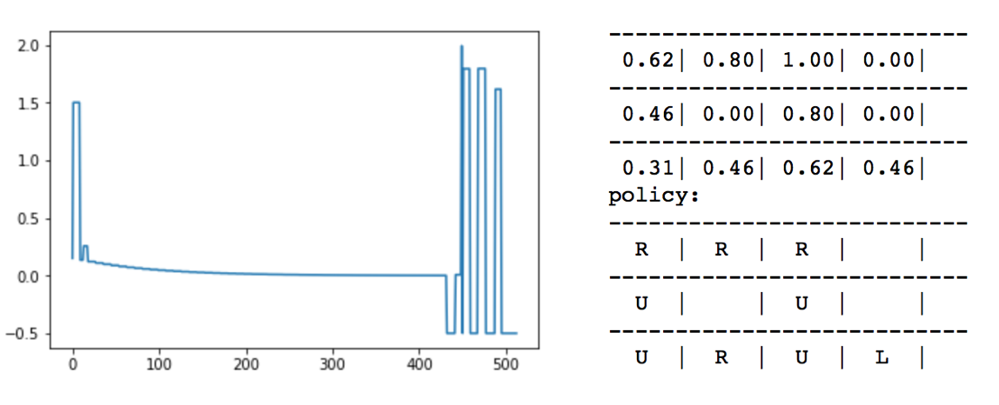

# Policy_Iteration_Grid_World

## Introduction

<span style="font-family:Papyrus"> The Grid-World problem is a striaght-forward problem. The goal of the agent is to find the optimal path to the termial state with highest reward. In our case it is located at state (0,3) and (1,3) with the lowest reward. As you can clearly see below, the optimal path the agent will take will be Up, Up, Right, Right, Right. It may find the other path starting out right first, but there is a chance of randomly exploring state (1,3), which has a reward of -1. Thus, we expect the optimal path to be the one stated explicitly above. Furthermore, we will be most interested in changing our values of gamma (discount factor) to see how our agent convergences in time. 
</span>


<p align="center">
  
</p>

### Fixed Policy iteration

<span style="font-family:Papyrus"> Fixed policy iteration is a subset problem to the overall Iterative Policy. The way iterative policy works on a high level is by randomly selects actions in all states of the grid. From here the fixed policy iteration converges on a value function that best represents that fix policy. The value function (in code as well for deterministic) is stated below.
</span>
```python
  V[s] = r + gamma * V[grid.current_state()]
```


<p align="center">
  
</p>

### Iterative Policy Evaluation

<span style="font-family:Papyrus"> The difference between iterative policy evaluation and fixed policy iteration is that iterative policy evaluation contains fixed policy iteration in it. Policy evaluation takes a random set of actions (policy) and estimates (converges) on its value function (stated above) and then tries a new policy, estimates its value function till convergence and decides whether or not to keep it via keeping the higher value policy. Once the policy hasn't changed from the last fixed policy iteration the Policy Evaluation has converged (see code below).
</span>

```python
if v > best_value:
            best_value = v
            new_a = a
            #print(v)
        policy[s] = new_a
        
        if new_a != old_a:
          is_policy_converged = False
 ```
### Changing Gamma (Discount Factor)

#### Gamma Large vs Gamma Small
<p align="center">
  
</p>
<p align="center">
  
</p>

<span style="font-family:Papyrus"> We can see from the above graphs how gamma affected the convergance rate and values of the function. The top graph (gamma = .1) shows convergance of policy occurred around 100 total iterations. While gamma large (gamma = .9) converged around 500 total iterations. I ran the this experiemnt several times and each time simmiliar graphs were demonstated. With gamma large, we seemed to have a long time before convergance on our fixed policy value. I made the graph represent a policy convergence when the y value hit -.5 (see code below on how I did this). The first convergence is slow with gamma being high and pretty regular when gamma is small. 
</span>

```python
SMALL_ENOUGH = 1e-3
GAMMA = 0.9
ALL_POSSIBLE_ACTIONS = ('U', 'D', 'L', 'R')
count = 0
result_array = np.array([])

#...

biggest_change = max(biggest_change, np.abs(old_v - V[s]))
          
          if biggest_change < SMALL_ENOUGH:
                biggest_change = -.5
          result_array = np.append(result_array, biggest_change)
#...
import matplotlib.pyplot as plt
plt.plot(result_array)
plt.show()
```
## Conclusion

<span style="font-family:Papyrus"> Fixed policy iteration is a sub algorithm of Policy Evaluation. Thus, having two convergnece loops can be computationally expensive, but we can be certain of finding an optimal policy given this algorithm. As for large and small values of Gamma, we can say both converge on the optimal policy but for this particular enviroment, a small gamma did it using less computational power. However, the values generated from the larger Gamma seemed to be most reasonable for understanding the problem, since it is reasonable to have a penalty for being further from the terminal states. However, small Gamma showed very little to noseemly no difference from the starting position to right and up states. 
</span>
