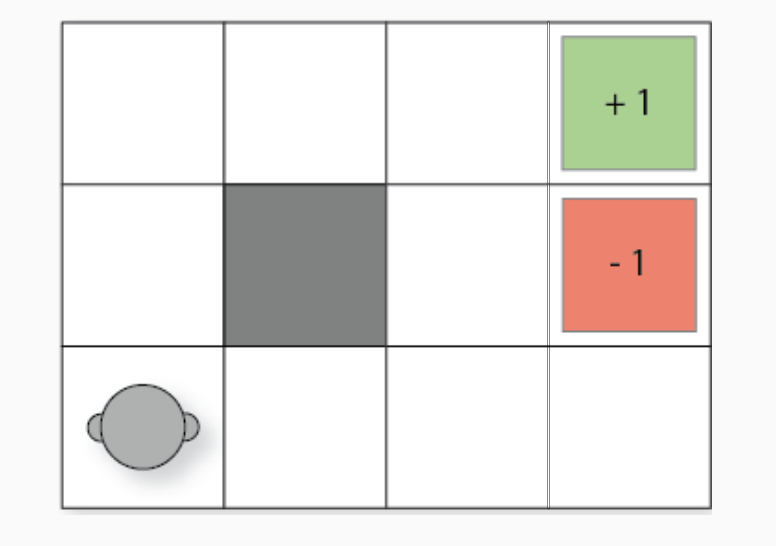
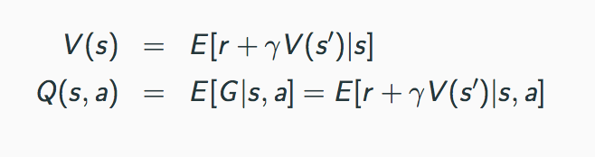

# Policy_Iteration_Grid_World

## Introduction

<span style="font-family:Papyrus"> The Grid-World problem is a striaght-forward problem. The goal of the agent is to find the optimal path to the termial state with highest reward. In our case it is located at state (0,3) and (1,3) with the lowest reward. As you can clearly see below, the optimal path the agent will take will be Up, Up, Right, Right, Right. It may find the other path starting out right first, but there is a chance of randomly exploring state (1,3), which has a reward of -1. Thus, we expect the optimal path to be the one stated explicitly above. Furthermore, we will be most interested in changing our values of gamma (discount factor) to see how our agent convergences in time. 
</span>


<p align="center">
  
</p>

### Fixed Policy iteration

<span style="font-family:Papyrus"> Fixed policy iteration is a subset problem to the overall Iterative Policy. The way iterative policy works on a high level is by randomly selects actions in all states of the grid. From here the fixed policy iteration converges on a value function that best represents that fix policy. The value function (in code as well for deterministic) is stated below.
</span>
```python
  V[s] = r + gamma * V[grid.current_state()]
```


<p align="center">
  
</p>

### Iterative Policy Evaluation

<span style="font-family:Papyrus"> The difference between iterative policy evaluation and fixed policy iteration is that iterative policy evaluation contains fixed policy iteration in it. Policy evaluation takes a random set of actions (policy) and estimates (converges) on its value function (stated above) and then tries a new policy, estimates its value function till convergence and decides whether or not to keep it via keeping the higher value (see code below).
</span>

```python
if v > best_value:
            best_value = v
            new_a = a
            #print(v)
        policy[s] = new_a
        
        if new_a != old_a:
          is_policy_converged = False
 ```
